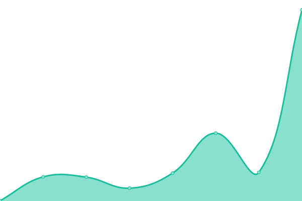
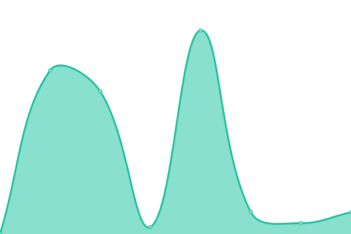
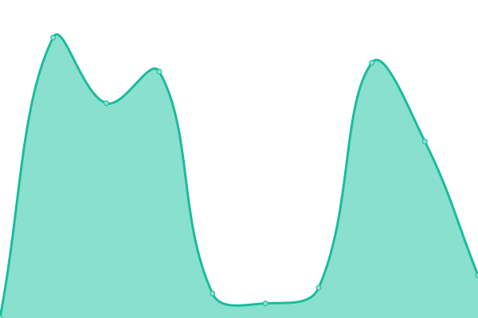

# [📈 Live Status](https://status.carbonate.dev): <!--live status--> **🟧 Partial outage**

This repository contains the open-source uptime monitor and status page for [Carbonate](https://carbonate.dev), powered by [Upptime](https://github.com/upptime/upptime).

With [Upptime](https://upptime.js.org), you can get your own unlimited and free uptime monitor and status page, powered entirely by a GitHub repository. We use [Issues](https://github.com/Carbonate-dev/statuspage/issues) as incident reports, [Actions](https://github.com/Carbonate-dev/statuspage/actions) as uptime monitors, and [Pages](https://status.carbonate.dev) for the status page.

<!--start: status pages-->
<!-- This summary is generated by Upptime (https://github.com/upptime/upptime) -->
<!-- Do not edit this manually, your changes will be overwritten -->
<!-- prettier-ignore -->
| URL | Status | History | Response Time | Uptime |
| --- | ------ | ------- | ------------- | ------ |
|  [Website](https://carbonate.dev) | 🟥 Down | [website.yml](https://github.com/Carbonate-dev/statuspage/commits/HEAD/history/website.yml) | 

 181ms
     
 | 

<a href="https://status.carbonate.dev/history/website">100.00%</a>
    

|  [API (Prod)](https://api.carbonate.dev/docs) | 🟩 Up | [api-prod.yml](https://github.com/Carbonate-dev/statuspage/commits/HEAD/history/api-prod.yml) | 

 3050ms
     
 | 

<a href="https://status.carbonate.dev/history/api-prod">100.00%</a>
    

|  [API (Staging)](https://api.staging.carbonate.dev/docs) | 🟩 Up | [api-staging.yml](https://github.com/Carbonate-dev/statuspage/commits/HEAD/history/api-staging.yml) | 

 1602ms
     
 | 

<a href="https://status.carbonate.dev/history/api-staging">100.00%</a>
    

<!--end: status pages-->

[**Visit our status website →**](https://status.carbonate.dev)

## 📄 License

- Powered by: [Upptime](https://github.com/upptime/upptime)
- Code: [MIT](./LICENSE) © [Carbonate](https://carbonate.dev)
- Data in the `./history` directory: [Open Database License](https://opendatacommons.org/licenses/odbl/1-0/)
